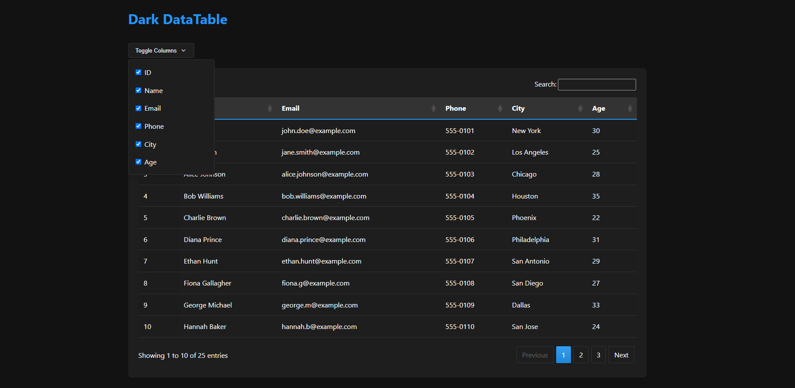

# Dark DataTables with PHP

## Table of Contents

- [Overview](#overview)
- [Prerequisites](#prerequisites)
- [Installation](#installation)
- [Contact & Support](#contact--support)
- [License](#license)

## Overview

This project implements a dark-themed DataTables interface using PHP, providing server-side processing for DataTables with features such as:

- Search, Sorting, Pagination, Column toggling
- Sleek, simple dark UI

This project is designed for learning purposes and local projects.

## Prerequisites

Ensure you have the following installed:

1. PHP 7.4 or higher
2. Composer
3. MySQL or MariaDB
4. Web server (Apache or Nginx recommended)

## Installation

1. **Install Composer**  
   If you haven't installed Composer, follow the instructions on [Composer's official website](https://getcomposer.org).

2. **Clone or Download the Repository**

   ```bash
   git clone https://github.com/your-username/dark-datatables-php.git
   cd dark-datatables-php
   ```

3. **Install Dependencies**  
   Ensure you're in the project's root directory and run:

   ```bash
   composer install
   ```

4. **Configure Database Settings**  
   Edit the `.env` file located in `App/Config/` and set your database connection details.

   - If using Docker, set:
     ```
     DB_HOST=host.docker.internal
     ```
   - If using localhost, set:
     ```
     DB_HOST=localhost
     ```

   Additional database configurations:

   ```
   DB_NAME=your_database_name
   DB_USER=your_username
   DB_PASSWORD=your_password
   DB_CHARSET=utf8mb4
   ```

5. **Create Database**  
   Use the provided SQL file to create your database and table. You can modify these settings later if required.

6. **Run the Project**  
   Ensure your web server and database are running, then access the project through your browser.

Enjoy the dark-themed UI!

## Contact & Support

For any questions or issues, feel free to:

- Open an issue in the repository.
- Contact directly on Discord: `DataBase379`.

## License

This project is for educational purposes and is open-source. Feel free to modify and use it in your local projects!


